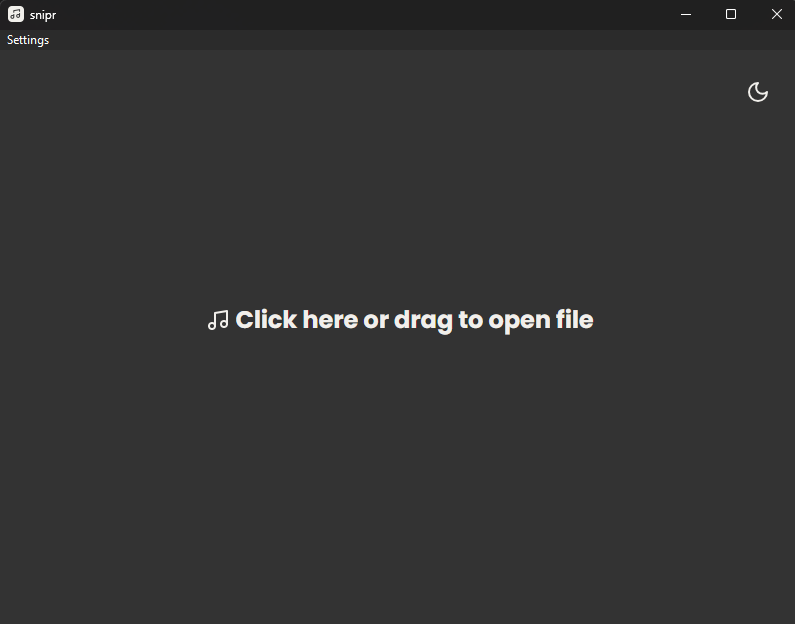
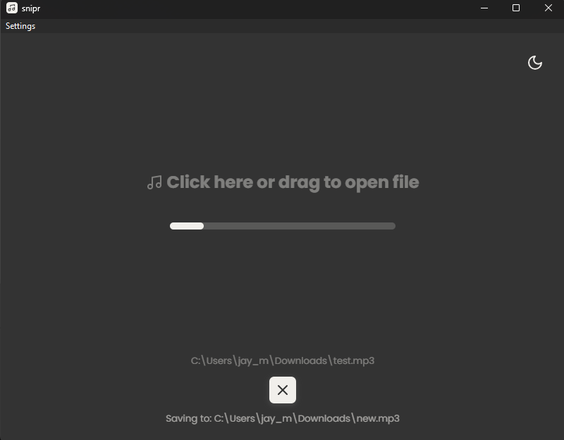
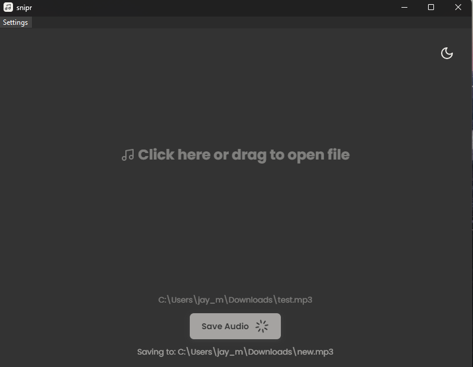
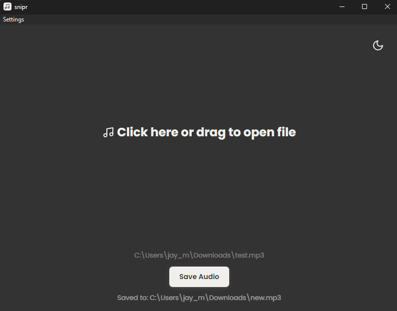

# snipr

Remove silences from audio really quickly...

Upload your audio file and choose where to save it (optional):

Your file is decoded and silences are removed:

Your new audio file is saved (if you selected a location to save it):

You can save your audio file again or upload a new one:

Currently in the works:

- [ ] Find the transcription using OpenAI whisper (on the ai branch)
- [ ] Enable editing the audio file using work
